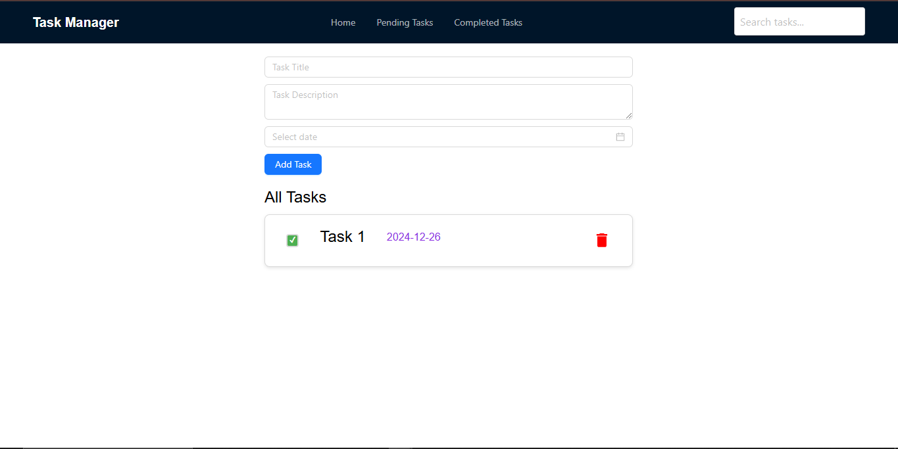
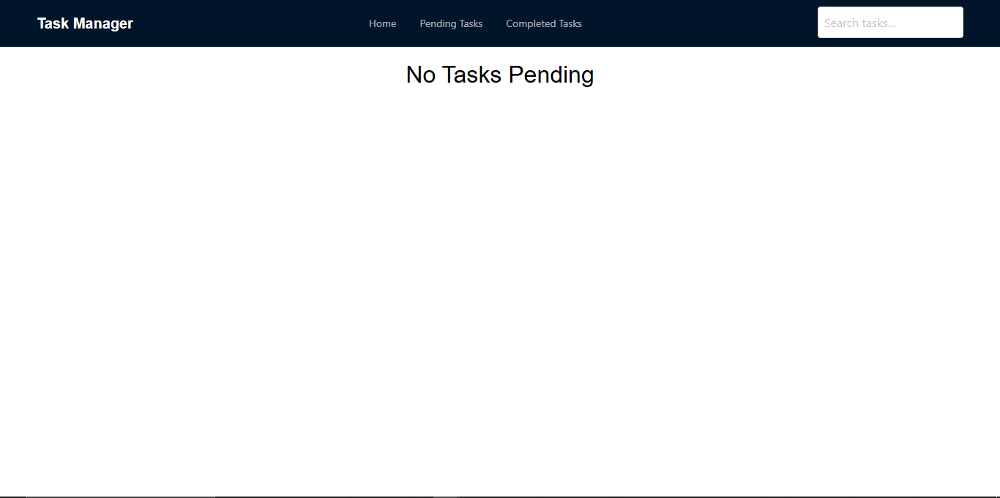
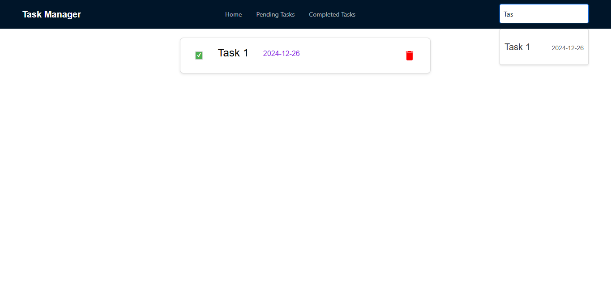
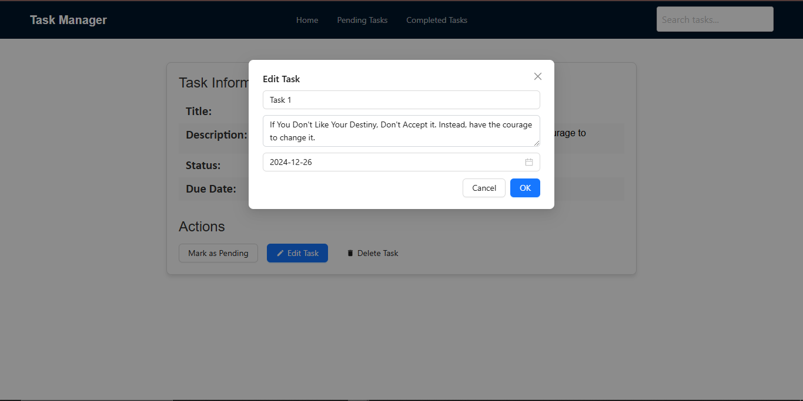
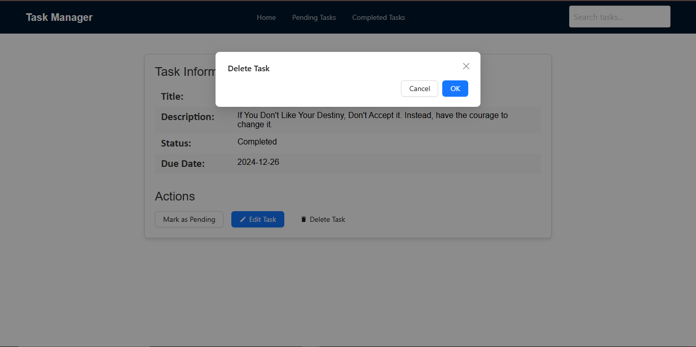

# Task Management System

This is a simple **Task Management System** built using **ReactJS** and **LocalStorage** for storing tasks locally in the browser. The application allows users to manage their daily tasks, mark them as completed, and delete them.

## Features

- Add new tasks
- Mark tasks as completed
- Delete tasks
- Persist tasks data using LocalStorage

## Technologies Used

- **ReactJS** - Frontend framework for building the user interface
- **LocalStorage** - For persisting tasks data in the browser

## Installation

To get started with the Task Management System, follow the steps below:

### Prerequisites

Make sure you have the following installed:

- **Node.js** (version 14.x or higher)
- **npm** (Node package manager)

### Steps to Install

1. Clone this repository to your local machine:

   ```bash
   git clone 
   ```

2. Navigate into the project directory:

   ```bash
   cd task-management-system
   ```

3. Install dependencies:

   ```bash
   npm install
   ```

4. Start the development server:

   ```bash
   npm start
   ```

   This will open the application in your default browser at [http://localhost:3000](http://localhost:3000).

## Usage

- **Add a task:** Type your task description in the input box and click the "Add Task" button to add a task to the list.
- **Mark as completed:** Click the checkbox next to a task to mark it as completed. The task will be displayed with a line through it.
- **Delete a task:** Click the delete button (trash icon) next to a task to remove it from the list.
- **Search a Tasks:**  You can Search Tasks
- **View Tasks:** We can view tasks.

## Snapshots
***Home Page***


***Pending Tasks***


***Completed Tasks***


***Search Tasks***


***View Tasks***


***Edit Tasks***


***Delete Tasks***



## LocalStorage

Tasks are saved in the browser's LocalStorage, which means the tasks will persist even if the page is refreshed. However, tasks are not saved across different browsers or devices.

## Contributing

Feel free to fork this project, submit issues, or open pull requests if you'd like to contribute.

